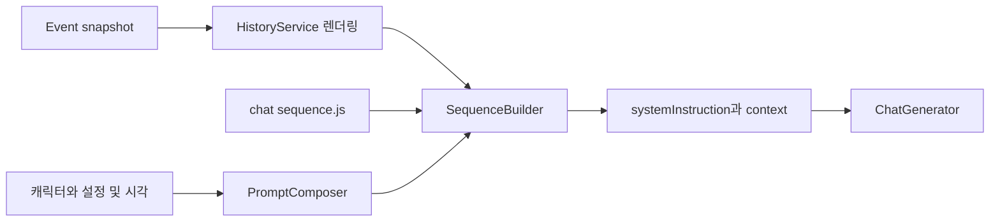

# 컨텍스트와 프롬프트

ChatContextPreparer는 같은 기준 시각으로 사건 기록과 프롬프트를 조립한다. 모델 입력의 내용과 순서를 바꾸려면 이 계층과 HistoryService를 함께 확인한다.

## 히스토리와 입력의 경계

HistoryService는 마지막으로 보낸 봇 SENT 사건까지를 `historyMessages`, 그 이후를 `pendingMessages`로 배치한다. 이 배치 경계와 처리 대상 입력의 경계는 다르다. 처리 대상은 ConversationState cursor 이후의 LIVE 사용자 사건과 재생성 입력 사건으로 결정한다.

EventRepository는 현재 전체 관찰 이력을 조회한다. `conversation.maxContextMessages`나 `maxHistoryDays`로 잘라내지 않는다. sequence의 history step에 `slice`를 지정하면 해당 history 배치만 자를 수 있으며 pending 전체를 자동 제한하지 않는다. 긴 대화의 토큰 한도·비용을 고려해 별도 정책을 설계해야 한다.

첫 관찰과 직전 관찰에서 5분 이상 지난 관찰에 시각 표지를 붙인다. 전체 사건을 먼저 렌더링하므로 history/pending이나 slice 경계마다 표지를 새로 계산하지 않는다. 자신의 LIVE READ·SENT는 assistant, 그 밖의 관찰은 user로 표현한다.

## sequence 계약

`content/prompts/<prompt>/chat/sequence.js`는 비어 있지 않은 배열을 export한다. 정확히 한 step에 `role: "system"`이 있어야 하며 참조 파일의 존재를 확인한다.

| type | 동작 |
| --- | --- |
| `file` | chat 디렉터리의 `source` 템플릿을 렌더링 |
| `text` | `content` 문자열 렌더링 |
| `placeholder` | `template` 또는 `source`를 템플릿 표현식으로 렌더링 |
| `history` | 관찰 히스토리 삽입, 선택적 배열 `slice` 적용 |
| `pending` | 마지막 봇 전송 뒤 관찰 삽입 |
| `response` | `sources` 파일들과 현재 시각을 하나의 user 지시로 추가 |
| `cache-point` | 현재는 no-op. provider 캐시 메타데이터를 전달하지 않음 |

PromptComposer는 `data`, `system.now`, `runtime`, `config`, `character` 네임스페이스를 만든다. Handlebars 렌더러는 `src/utils/renderTemplate.js`, 시각·런타임 컨텍스트 구성은 `src/utils/templateContext.js`에서 확인한다. `character`는 identity 문자열로도 사용된다.

채팅은 캐릭터 `config.json`의 필수 `timezone`으로 관찰 시각, 현재 시각, 나이·학년 계산의 기준을 통일한다. 한 요청에서 만든 system 컨텍스트를 identity와 모든 sequence step에 공유한다. `system.now.raw`는 초와 실제 시간대 오프셋을 포함한 ISO 8601이고, `date`·`time`·`weekday`·`year`도 같은 지역 날짜를 사용한다. 관찰 표지의 날짜 언어는 `app.language`를 따르며 한국어의 오전·오후는 `AM/PM`으로 정규화한다.

systemInstruction은 모델 요청의 system 필드로 전달하고 context의 role은 assistant 또는 user로 정규화한다. JSON처럼 작성한 모델 도구 호출을 회수하는 예외 경로는 [도구와 이미지](도구와%20이미지.md)에 설명한다.

## 현재 없는 연결

`summary`·`embedding` 설정이 존재해도 요약·기억 검색을 컨텍스트에 자동 주입하지 않는다. `src/ai/summary.js`의 보조 함수는 현재 런타임에서 호출되지 않는다. 비공개 팩의 실제 문구는 이 위키에 복사하지 않는다.

## 클래스별 입력과 출력

| 클래스 | 하는 일 | 결과 |
| --- | --- | --- |
| EventRepository | 저장된 경험과 current Message를 트랜잭션으로 확인 | snapshot 범위·events·선택적 replay |
| HistoryService | replay 병합, 입력 판별, 관찰 렌더링과 배치 | historyMessages·pendingMessages·inputMessages·messageIds·eventSnapshot |
| HistoryMessageFormatter | 생성 이미지 첨부를 텍스트로 설명 | 이미지 ID·파일명과 조회한 이미지 생성 프롬프트 |
| ChatContextPreparer | 기준 시각 고정, 팩 조회, sequence 실행 | context·systemInstruction과 기록용 입력 |
| PromptComposer | 캐릭터·시각·설정 네임스페이스 구성 | 템플릿 렌더링 context |
| SequenceBuilder | step 배열을 순서대로 평가 | 독립 systemInstruction과 role/content 목록 |

Generation.input에 저장하는 inputMessages는 모델에 보낸 context 전체가 아니다. 이번에 처리할 사용자 사건의 렌더링 본문이다. 전체 모델 입력과 system 지시를 분석하려면 API request metadata도 확인한다.

## 두 경계가 다른 구체적인 예

사건이 READ 10, SENT 11, READ 12이고 cursor가 10이라고 가정한다. 화면 배치상 history에는 10과 11, pending에는 12가 들어간다. 처리 입력은 cursor 뒤의 LIVE 사용자 사건인 12다.

반대로 실패 안내 SENT 11 뒤에도 cursor가 0이면 READ 10은 history 배치에 있어도 처리되지 않은 입력으로 남을 수 있다. pendingMessages라는 이름만 보고 처리 대상을 결정하면 이전 실패 입력을 놓친다.

위 숫자는 설명용 Event ID다. ID가 전역이므로 실제 같은 채널의 사건 번호 사이에 다른 채널의 사건이 들어갈 수 있다.

## sequence를 바꿀 때 확인할 것

sequence의 step 순서가 실제 모델 메시지 순서가 된다. 파일 이름만 바꿔도 기존 import된 sequence 배열이 즉시 갱신되는 것은 아니다. 팩 변경 검증은 새 프로세스에서 수행한다.

file·text·placeholder가 role을 생략하면 user로 배치한다. response step은 지정한 sources를 합치고 같은 기준 시각의 Current Time을 덧붙인다. history와 pending은 이미 렌더링한 관찰 role을 유지한다.

관찰 시각은 사건을 읽은 시각이다. 원래 플랫폼 발송 시각과 혼동하지 않는다. history slice를 바꿔도 시간 표지는 slice 전 전체 관찰을 기준으로 계산하므로 잘린 첫 관찰에 반드시 새 시각 표지가 생기는 것은 아니다.

현재 buildContext는 config 전체를 템플릿에 제공한다. 공개 팩에 인증 설정을 출력하는 표현식을 넣지 않는다. 일반 프롬프트 변수 추가는 비밀 설정과 구분해서 설계한다.

## 근거와 검증

구현: `src/chat/context/ChatContextPreparer.js`, `src/chat/context/SequenceBuilder.js`, `src/chat/context/PromptComposer.js`, `src/utils/templateContext.js`, `src/messages/HistoryService.js`, `src/ai/chat.js`.

테스트: `test/chat/context/ContextAssembly.test.js`, `test/chat/context/SequenceBuilder.test.js`, `test/chat/context/PromptPipeline.test.js`, `test/chat/context/ChatContextPreparer.test.js`, `test/utils/templateContext.test.js`, `test/ai/messages.test.js`.

[홈](../홈.md) · [캐릭터](캐릭터.md) · [테스트와 프롬프트 비교](../개발/테스트와%20프롬프트%20비교.md)
