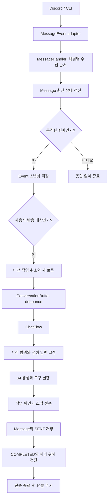
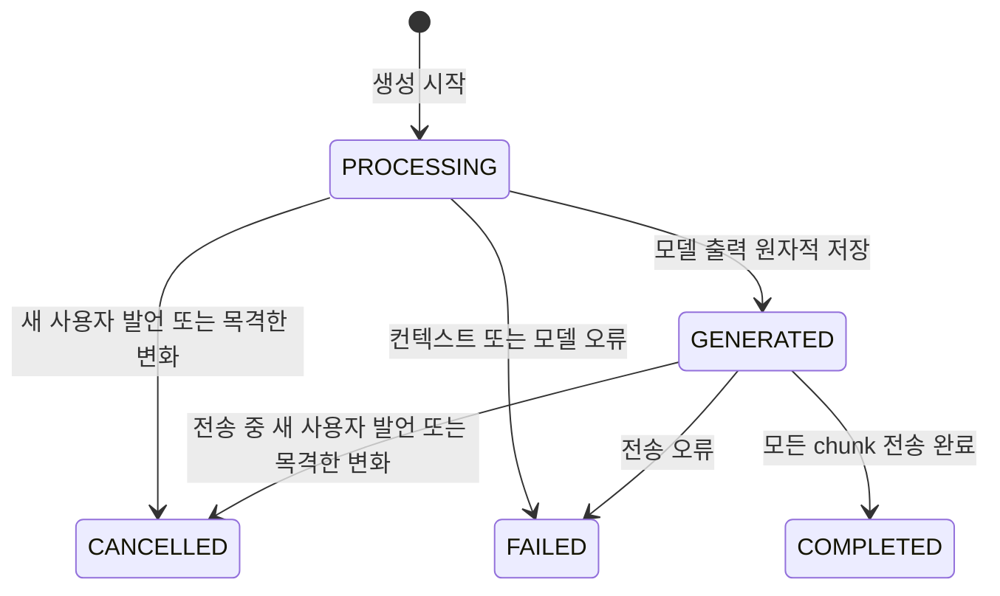

# Architecture

AiMate는 Discord와 CLI 입력을 하나의 애플리케이션 파이프라인으로 처리한다. 외부 런타임 객체는 플랫폼 어댑터에서 정규화하며, 애플리케이션 계층 아래에서는 Discord.js 객체를 사용하지 않는다.

## 의존 방향

```text
Discord / CLI
    ↓
Platform adapter
    ↓
Application use case
    ↓
Chat / Message service
    ↓
Repository
    ↓
Prisma / SQLite
```

다음 규칙을 유지한다.

- `src/platforms/`는 Discord와 CLI 객체를 애플리케이션 계약으로 변환하고 결과를 플랫폼 형식으로 표시한다.
- 플랫폼 이벤트와 명령은 `src/application/`의 유스케이스 또는 공개 애플리케이션 진입점만 호출한다. Repository를 직접 사용하지 않는다.
- `src/application/contracts.js`가 플랫폼과 애플리케이션 사이의 메시지, 채널, 대화 요청 계약을 정의한다.
- `src/chat/`은 대화 생성 순서를 조정하며 플랫폼 SDK와 Prisma를 직접 참조하지 않는다.
- `src/messages/`는 메시지 저장, 기록 조회, 전송을 담당한다.
- 일반 영속 데이터 접근은 `src/repositories/`에 둔다. `src/core/shutdown.js`의 전체 진행 Generation 취소는 현재 종료 처리에 남아 있는 예외다.
- `src/core/container.js`가 객체 생성과 의존성 연결을 담당한다.
- 주 응답 경로는 명시적인 호출로 유지하고, `EventBus`는 기억 추출 같은 부가 정책에만 사용한다.

## 디렉터리 책임

| 경로                | 책임                                                                   |
| ------------------- | ---------------------------------------------------------------------- |
| `src/application/`  | 플랫폼 독립 계약과 플랫폼 진입점용 유스케이스                          |
| `src/ai/`           | 모델 생성, Vercel AI SDK 호출, provider 설정과 메타데이터              |
| `src/chat/`         | 버퍼링 이후의 대화 생성 흐름, 컨텍스트, 응답 파싱, Generation 수명주기 |
| `src/core/`         | composition root, 이벤트, 로깅, 종료 처리                              |
| `src/messages/`     | 메시지 저장, 히스토리 변환, 응답 전송                                  |
| `src/platforms/`    | Discord와 CLI 진입점, 어댑터, 사용자 인터페이스                        |
| `src/repositories/` | Prisma 데이터 접근                                                     |
| `src/tools/`        | 모델에 노출하는 도구 정의와 실행 컨텍스트                              |

## 메시지 처리 흐름



`MessageEvent`는 CREATE/UPDATE/DELETE를 공통 계약으로 전달한다. 생성·수정은 `NormalizedMessage`, 삭제는 플랫폼 메시지 ID 목록을 담는다. 부분 메시지 조회는 지연 함수로 제공한다. 플랫폼 SDK 객체는 내부 데이터로 전달하지 않는다.

`ConversationSession`은 주시 여부, 현재 작업 토큰, 채널별 짧은 작업의 순서를 관리한다. `ConversationBuffer`는 debounce만 담당한다. 플랫폼과 채널 ID의 튜플을 키로 사용한다. 일반 입력과 재생성은 같은 세션으로 `ChatFlow`를 실행한다.

`Message`는 최신 상태이고 `Event`는 목격한 경험이다. 주시 중 수정·삭제는 기존 생성을 취소하고 다시 예약한다. 비주시 중 변경은 현재 상태만 갱신한다. 과거 내역을 나중에 읽는 것과 편집 순간을 목격한 것은 별도로 표현한다.

생성 입력은 Event 순서와 처리 위치로 고정한다. 확인된 전송 조각만 SENT로 남기며, 정상 완료와 처리 위치 전진을 한 트랜잭션에서 수행한다. 실패·취소는 이미 목격한 경험을 지우거나 완료 처리하지 않는다. 모델 호출과 플랫폼 전송 대기는 채널 큐 밖에서 실행한다.

세부 정책과 검증 범위는 [메시지 사건과 대화 주시](message-observation-design.md)를 참조한다.

## Generation 상태



모델 호출 전에는 `PROCESSING` 상태를 유지한다. 모델 결과 저장과 `GENERATED` 전환은 현재 상태가 여전히 `PROCESSING`일 때만 함께 수행한다. 따라서 모델 실행 도중 취소된 Generation의 출력이 상태를 되돌리지 않는다.

## 조립과 공개 진입점

`src/core/container.js`는 Repository, 서비스, Generation 수명주기, 도구, 유스케이스를 생성한다. 플랫폼 bootstrap에는 필요한 공개 진입점만 반환한다.

- 메시지 이벤트: `messageHandler`
- Discord 명령: `activateChannel`, `storedMessageService`, `getGenerationInfo`, `rerollConversation`
- CLI 채널 목록: `channelCatalog`
- 종료 처리: `conversationBuffer`

새 플랫폼을 추가할 때는 `NormalizedMessage`, `ChannelPort`, `MessageEvent` 어댑터를 구현한다. 기존 chat, message, repository 계층에 플랫폼별 분기를 추가하지 않는다.
