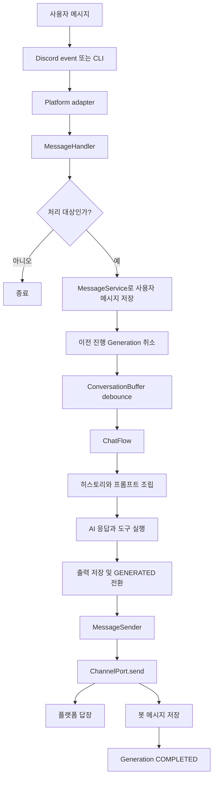
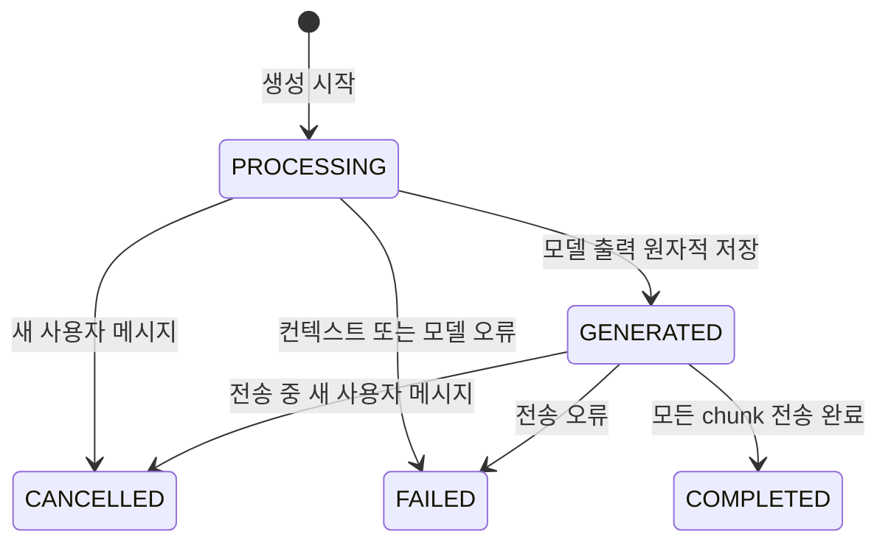

# Architecture

AiMate는 Discord와 CLI 입력을 하나의 애플리케이션 파이프라인으로 처리한다. 외부 런타임 객체는 플랫폼 어댑터에서 정규화하며, 애플리케이션 계층 아래에서는 Discord.js 객체를 사용하지 않는다.

## 의존 방향

```text
Discord / CLI
    ↓
Platform adapter
    ↓
Application use case
    ↓
Chat / Message / Scheduling service
    ↓
Repository
    ↓
Prisma / SQLite
```

다음 규칙을 유지한다.

- `src/platforms/`는 Discord와 CLI 객체를 애플리케이션 계약으로 변환하고 결과를 플랫폼 형식으로 표시한다.
- 플랫폼 이벤트와 명령은 `src/application/`의 유스케이스 또는 공개 애플리케이션 진입점만 호출한다. Repository를 직접 사용하지 않는다.
- `src/application/contracts.js`가 플랫폼과 애플리케이션 사이의 메시지, 채널, 대화 요청 계약을 정의한다.
- `src/chat/`은 대화 생성 순서를 조정하며 플랫폼 SDK와 Prisma를 직접 참조하지 않는다.
- `src/messages/`는 메시지 저장, 기록 조회, 전송을 담당한다.
- 일반 영속 데이터 접근은 `src/repositories/`에 둔다. `src/core/shutdown.js`의 전체 진행 Generation 취소는 현재 종료 처리에 남아 있는 예외다.
- `src/core/container.js`가 객체 생성과 의존성 연결을 담당한다.
- 주 응답 경로는 명시적인 호출로 유지하고, `EventBus`는 재시도나 Discord 상태 변경 같은 부가 정책에만 사용한다.

## 디렉터리 책임

| 경로                | 책임                                                                   |
| ------------------- | ---------------------------------------------------------------------- |
| `src/application/`  | 플랫폼 독립 계약과 플랫폼 진입점용 유스케이스                          |
| `src/ai/`           | 모델 생성, Vercel AI SDK 호출, provider 설정과 메타데이터              |
| `src/chat/`         | 버퍼링 이후의 대화 생성 흐름, 컨텍스트, 응답 파싱, Generation 수명주기 |
| `src/core/`         | composition root, 이벤트, 로깅, 종료 처리                              |
| `src/messages/`     | 메시지 저장, 히스토리 변환, 응답 전송                                  |
| `src/platforms/`    | Discord와 CLI 진입점, 어댑터, 사용자 인터페이스                        |
| `src/repositories/` | Prisma 데이터 접근                                                     |
| `src/scheduling/`   | 예약 등록, polling worker, LLM 재시도 정책                             |
| `src/tools/`        | 모델에 노출하는 도구 정의와 실행 컨텍스트                              |

## 메시지 처리 흐름



`NormalizedMessage`에는 저장과 처리에 필요한 순수 데이터만 포함된다. `ChannelPort`는 `send`와 `sendTyping`만 제공한다. Discord.js의 `Message`, `Client`, `Interaction` 객체는 플랫폼 계층 밖으로 전달하지 않는다.

`ConversationBuffer`는 `platform:platformChannelId`를 키로 사용하므로 서로 다른 플랫폼에서 같은 채널 ID를 사용해도 충돌하지 않는다. 일반 사용자 메시지와 예약 작업 모두 `ConversationRequest`로 `ChatFlow`를 호출한다.

각 `Generation`은 하나의 대화 턴 기록 단위다. 버퍼링 전의 사용자 메시지는 즉시 독립 저장하고, 생성이 시작될 때 해당 턴이 소비한 메시지 목록과 입력 스냅샷을 하나의 트랜잭션으로 `Generation`에 연결한다. 모델 출력과 상태 전환도 조건부 갱신으로 함께 기록하며, 전송된 봇 메시지는 동일한 `generationId`로 저장한다.

## Generation 상태



모델 호출 전에는 `PROCESSING` 상태를 유지한다. 모델 결과 저장과 `GENERATED` 전환은 현재 상태가 여전히 `PROCESSING`일 때만 함께 수행한다. 따라서 모델 실행 도중 취소된 Generation의 출력이 상태를 되돌리지 않는다.

## 조립과 공개 진입점

`src/core/container.js`는 Repository, 서비스, Generation 수명주기, 도구, 유스케이스를 생성한다. 플랫폼 bootstrap에는 필요한 공개 진입점만 반환한다.

- 메시지 이벤트: `messageHandler`
- Discord 명령: `activateChannel`, `storedMessageService`, `getGenerationInfo`, `rerollConversation`
- CLI 채널 목록: `channelCatalog`
- 예약 실행: `cronJobWorker`
- 종료 처리: `conversationBuffer`, `cronJobWorker`

새 플랫폼을 추가할 때는 `NormalizedMessage`, `ChannelPort`, `IncomingMessageRequest` 어댑터와 예약 작업용 dispatcher를 구현한다. 기존 chat, message, repository 계층에 플랫폼별 분기를 추가하지 않는다.
