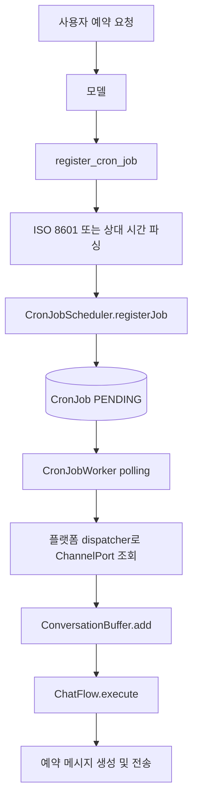

# 예약 작업 가이드

AiMate의 예약 작업은 외부 cron 라이브러리가 아니라 SQLite에 저장한 작업과 `CronJobWorker`의 Node.js 타이머 polling으로 실행한다.

## 구성 요소

| 구성 요소             | 책임                                                   |
| --------------------- | ------------------------------------------------------ |
| `CronJobRepository`   | 예약 작업 생성, 조회, 상태 변경과 정리                 |
| `CronJobScheduler`    | 일반 예약과 LLM 과부하 재시도 등록                     |
| `CronJobWorker`       | 실행 시각이 지난 작업 조회와 플랫폼 채널 dispatch      |
| `register_cron_job`   | 모델이 사용자 요청에 따라 예약을 등록하는 도구         |
| `registerRetryPolicy` | 429 또는 503 응답을 예약 재시도로 변환하는 이벤트 정책 |

`CronJob`의 주요 상태는 다음과 같다.

- `PENDING`: 실행 대기 중
- `EXECUTED`: 대화 요청을 버퍼에 전달함
- `CANCELLED`: 지원하지 않는 플랫폼이거나 채널을 찾을 수 없어 실행할 수 없음

작업 종류는 사용자 요청으로 생성되는 `ai_scheduled`와 LLM 과부하 후 생성되는 `llm_retry`가 있다.

## 사용자 예약 흐름



상대 시간은 `1h`, `30m`, `2h30m` 형식을 지원한다. 기준 시각은 도구 실행 시점이 아니라 원래 사용자 요청의 `requestCreatedAt`이다. 절대 시각은 JavaScript `Date`가 해석할 수 있는 ISO 8601 형식을 사용한다.

예약 시각에 Worker가 메시지를 직접 전송하지는 않는다. 저장된 `message`를 `cronMessage`로 포함한 `ConversationRequest`를 버퍼에 전달하며, 이후에는 일반 메시지와 같은 ChatFlow를 사용한다.

## LLM 과부하 재시도

`ChatGenerationFailureHandler`는 모델 오류가 429 또는 503이면 `generation.serviceUnavailable` 이벤트를 발행한다. `registerRetryPolicy`가 이 이벤트를 받아 현재 채널에 `llm_retry` 작업을 등록한다.

재시도 시각은 등록 시점부터 1시간에 최대 15분의 무작위 지연을 더한 시각이다. 서비스 과부하에는 즉시 오류 답장을 보내지 않고 예약 작업이 이전 대화에 이어 응답하도록 한다.

```text
429 / 503
  → Generation FAILED
  → generation.serviceUnavailable
  → CronJobScheduler.registerRetryJob
  → CronJob PENDING
  → 예약 시각에 일반 ChatFlow 재실행
```

## Worker 동작

Discord 진입점은 애플리케이션 생성 후 Worker를 시작하고 종료 처리에 Worker를 등록한다.

```js
app.cronJobWorker.start();

registerShutdown({
  conversationBuffer: app.conversationBuffer,
  cronJobWorker: app.cronJobWorker,
  configManager,
  client,
});
```

기본 polling 간격은 5초다. 한 프로세스 안에서는 이전 조회가 끝나기 전에 다음 조회가 시작되지 않도록 동일한 실행 Promise를 공유한다.

작업별 결과는 다음과 같이 처리한다.

| 결과                                    | 처리           |
| --------------------------------------- | -------------- |
| 채널을 찾아 버퍼에 전달                 | `EXECUTED`     |
| 플랫폼 dispatcher 없음                  | `CANCELLED`    |
| 플랫폼 채널 없음                        | `CANCELLED`    |
| Repository, API 또는 버퍼의 일시적 예외 | `PENDING` 유지 |

`EXECUTED`는 AI 답장까지 완료됐다는 뜻이 아니라 ConversationBuffer에 요청을 정상적으로 전달했다는 뜻이다. ChatFlow 결과는 별도의 Generation 상태로 추적한다.

현재 중복 실행 방지는 단일 Node.js 프로세스 범위다. 여러 프로세스가 같은 데이터베이스를 polling하는 배포에서는 작업 claim을 DB에서 원자적으로 처리하는 별도 설계가 필요하다.

## 주요 API

### `CronJobScheduler`

- `registerJob(data)`: `PENDING` 작업 등록
- `registerRetryJob(channelId, platform, retryCount)`: 1시간과 무작위 지연 후의 `llm_retry` 등록

### `CronJobWorker`

- `start()`: 즉시 한 번 조회한 뒤 polling 시작
- `stop()`: polling 타이머 중지
- `checkAndExecuteJobs()`: 겹치지 않게 현재 실행 가능한 작업 처리
- `executeJob(job)`: 플랫폼 dispatcher를 통해 ConversationBuffer에 전달

### `CronJobRepository`

- `create(data)`: 작업 생성
- `getPendingJobs(beforeTime)`: 실행 시각이 지난 `PENDING` 작업 조회
- `updateStatus(id, status)`: `EXECUTED` 또는 `CANCELLED`로 변경
- `cancelPendingForChannel(channelId)`: 채널의 대기 작업 취소
- `findPendingByChannelAndType(channelId, type)`: 채널과 종류로 대기 작업 조회
- `cleanupOldJobs(daysOld)`: 오래된 완료·취소 작업 삭제

`cleanupOldJobs`는 현재 자동으로 호출되지 않는다. 운영 시 정리가 필요하면 별도의 명시적인 유지보수 경로를 추가해야 한다.
