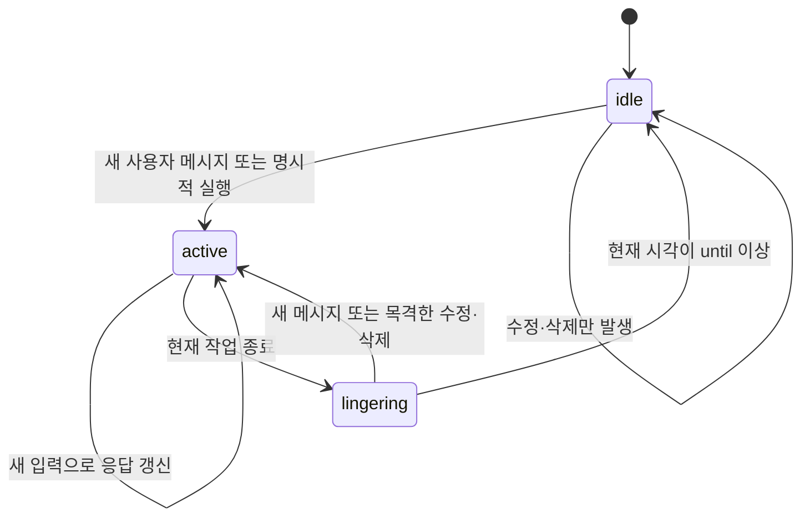

# 메시지 수정·삭제 인지와 대화 주시 최종 설계 보고서

작성일: 2026-09-18  
상태: 구현 기준 설계. 애플리케이션 코드와 DB에는 아직 적용하지 않았다.

## 1. 결정

Message는 플랫폼 메시지 하나당 한 행을 유지한다. 수정은 같은 행을 갱신하고, 삭제는 `deletedAt`으로 표시한다. AI가 목격한 내용과 변화는 별도의 불변 기록에 보존한다. 정상 응답을 마친 범위는 채널별 처리 위치로 관리한다. 주시 상태는 인메모리 세션에서 관리하며, 답변 전송 완료 후 60초까지 유지한다.

주시 종료 전용 타이머, Observation별 완료 표시, 전체 이벤트소싱, 분산 작업 관리자는 도입하지 않는다.

| 책임 | 저장 위치 | 변경 원칙 |
| --- | --- | --- |
| 플랫폼 메시지의 최신 상태 | Message | 같은 행 갱신, soft delete |
| AI가 목격한 내용과 변화 | Event | 사건을 추가하고 기존 내용은 유지 |
| 정상 응답으로 처리한 위치 | ConversationState | 성공 완료 시 앞으로만 이동 |
| 생성 입력과 실행 결과 | Generation | 입력 스냅샷 고정, 조건부 상태 전환 |
| 현재 주시 여부와 작업 소유권 | ConversationSession | 인메모리 상태, 재시작 시 비주시 |

이 문서에서 관찰 기록의 실제 모델 이름은 `Event`로 통일한다. 대화에서 사용한 `Observation`과 같은 개념이다. 기존 [대화·장기 기억 MVP 계획](conversation-memory-mvp-plan.md)의 Event와 별개로 MessageObservation 테이블을 추가하지 않는다.

이번 설계는 기존 기억 계획의 메시지 삭제 방식, 수정·삭제 관찰 조건, CHAT 처리 완료 판정을 구체화하거나 대체한다. Fact·Episode·Review와 reroll의 제품 범위 전체를 새로 정의하지는 않는다. 기존 문서는 그대로 보존하며, 이번 변경 범위에서는 본 문서를 구현 기준으로 사용한다.

## 2. 목표와 범위

AI는 현재 대화 대상으로 수신한 사용자 발언을 즉시 인지한다. Buffer는 응답 실행을 늦출 뿐, 읽는 시점을 결정하지 않는다. 주시 중에 일어난 수정·삭제는 원문과 함께 다음 생성 입력에 반영한다.

```text
사용자: 안녕?
사용자: 바보야
관찰: 방금 읽은 "바보야" 메시지가 삭제됨
AI: 다 봤거든?!
```

마지막 답변은 가능한 반응의 예시다. 삭제를 알아챌 근거를 제공하지만, 매번 지적하거나 특정 문구로 답하도록 강제하지 않는다.

보장할 동작:

- 새 사용자 메시지로 주시를 시작한다.
- 버퍼 대기·생성·전송 중 계속 주시한다.
- 마지막 정상 답변 조각의 전송 완료 후 60초 동안 계속 주시한다.
- 주시 중 수정·삭제는 기존 응답을 갱신하거나 새 응답을 예약한다.
- 비주시 중 수정·삭제는 Message만 갱신하고, 새로운 관찰이나 답변을 만들지 않는다.
- 이미 목격한 원문은 이후 수정·삭제나 생성 취소 때문에 사라지지 않는다.
- 재시작 후 주시는 종료 상태지만, 저장한 사건과 처리 위치는 유지한다.

전제는 단일 Node.js 프로세스와 SQLite다. 세션과 처리 위치의 논리 키는 `(characterId, channelId)`다. 같은 캐릭터·채널의 유효한 CHAT 실행은 하나로 제한하고, 다른 채널의 모델 요청은 동시에 진행할 수 있다. 여러 프로세스가 같은 채널을 처리하는 배포는 이번 보장 범위 밖이다.

## 3. 현재 코드와의 차이

| 현재 코드 | 현재 동작 | 변경 방향 |
| --- | --- | --- |
| [MessageRepository](../src/repositories/MessageRepository.js) | 수정 시 내용 덮어쓰기, 삭제 시 행 제거 | 최신 내용 갱신 유지, soft delete와 Event의 원자적 저장 |
| [MessageHandler](../src/messages/MessageHandler.js) | 버퍼가 있을 때만 수정·삭제로 응답 갱신 | 세션의 주시 판정으로 교체 |
| [ConversationBuffer](../src/chat/ConversationBuffer.js) | 실행 직전 타이머 항목 제거 | debounce 책임 유지, 주시 상태는 맡기지 않음 |
| [HistoryService](../src/messages/HistoryService.js) | 마지막 봇 메시지 뒤를 pending으로 판단 | 처리 위치 이후의 신규 입력 사건으로 판정 |
| [ChatFlow](../src/chat/ChatFlow.js) | 입력 준비, 생성, 조각 전송, 완료 | 세션 작업 토큰과 고정 사건 범위 전달 |
| [GenerationRepository](../src/repositories/GenerationRepository.js) | 입력 스냅샷과 Message 연결 저장 | 사건 입력 기록, 완료와 처리 위치 이동의 원자성 추가 |
| [MessageSender](../src/messages/MessageSender.js) | 전송한 조각을 Message로 저장 | 실제 전달 조각만 출력 사건으로 보존 |

필요한 연결 변경은 허용하되, Buffer에 두 번째 수명주기를 넣거나 Repository가 주시 여부를 직접 결정하지 않는다.

## 4. 데이터 모델

아래는 저장 계약이다. 완성된 Prisma 선언이나 적용된 마이그레이션은 아니다.

### 4.1 Message

- 기존 `id`와 `@@unique([platform, platformId])`를 유지한다.
- `content`는 최신 본문이다. 수정본마다 Message 행을 추가하지 않는다.
- `deletedAt: DateTime?`을 추가한다. 삭제 시 마지막 본문은 유지한다.
- 일반적인 현재 채팅 조회는 `deletedAt = null`만 반환한다. 원문 근거·관리 조회는 명시적으로 삭제 행을 포함한다.
- 삭제된 행에 늦은 create/update가 도착해도 자동 복구하지 않는다. 기존 upsert 경로에도 이 조건을 적용한다.
- 플랫폼이 제공하는 수정 시각 등 순서 판별 정보는 어댑터에서 보존한다. 신뢰할 수 있는 버전 정보가 있으면 이전 갱신을 거부하고, 없으면 애플리케이션 수신 순서까지만 보장한다.

일반 삭제에서 soft delete를 택하는 이유는 안정적인 메시지 식별자, 기존 참조 유지, 늦은 이벤트의 복구 방지다. AI가 이전 내용을 기억할 수 있는 직접적인 근거는 Event다. DB에 원문이 남았다는 이유만으로 AI 컨텍스트에 공개하지 않는다.

### 4.2 Event

| 정보 | 용도 |
| --- | --- |
| `id` | 자동 증가하는 관찰 순서 ID |
| `characterId`, `channelId` | 관찰 주체와 대화 범위 |
| `messageId`, 플랫폼 메시지 식별자 | Message 연결. 작성자는 `Message.author.user`로 조회하며 Event에 중복 저장하지 않음 |
| `kind` | READ, EDIT, DELETE, SENT |
| `observedAt` | 애플리케이션이 관찰한 시각 |
| 확인한 본문 스냅샷 | 이후 Message가 바뀌어도 유지할 내용 |
| 메시지별 Event 순서 | 같은 메시지의 Event를 ID 순서로 비교하되 모르는 원문을 노출하지 않음 |
| `batchId` | 대량 삭제 묶음에만 사용 |
| `generationId` | SENT의 실제 출력 생성 연결 |

`READ`는 사용자 발언을 읽은 사건, `EDIT`와 `DELETE`는 목격한 변화, `SENT`는 확인된 봇 출력이다. READ에는 실시간 수신인지 과거 내역을 현재 읽은 것인지 구분할 정보를 둔다. 후자를 방금 사용자가 새로 말한 것처럼 표현하지 않는다.

Event에는 `appliedInGenerationId`, 처리 완료 boolean, 주시 상태를 넣지 않는다. 최소 조회 인덱스는 `(characterId, channelId, id)`와 메시지별 관찰 조회 인덱스다. 특정 필드가 컬럼인지 JSON인지는 조회 필요에 따라 정하되, 순서와 범위 필터는 컬럼으로 둔다.

`messageId`는 nullable이다. 저장된 Message가 없는 삭제 ID를 기록할 때는 플랫폼 메시지 식별자만 남기고 작성자는 미상으로 둔다. 일반 삭제는 Message를 soft delete하므로 기존 Event의 작성자 조회와 Memory 참조는 유지된다.

원문 스냅샷은 DB의 이전 값과 AI가 이전에 본 값을 구별한다. 예를 들어 AI가 A를 본 뒤 비주시 중 B로 바뀌고, 다시 주시 중 삭제됐다면 B를 읽었다고 기록하지 않는다. 삭제를 관찰한 사실과 이전에 A를 읽은 사실만 제공한다. 주시 중 처음 보는 메시지의 수정은 새 본문을 제공할 수 있지만, 이전 원문은 확인되지 않았으면 미상으로 둔다.

등록된 Message와 작성자를 확인할 수 없는 삭제 ID만으로 원문·작성자·삭제 주체를 만들어내지 않는다. 이번 범위에서는 그런 삭제로 답변을 예약하지 않는다. 삭제 이벤트만으로 사용자가 직접 삭제했다고 단정하지도 않는다.

### 4.3 ConversationState와 Generation

`ConversationState`에는 `(characterId, channelId)` 고유 키와 `handledThroughEventId`를 둔다. 초기 위치는 0이다. 이는 해당 순서까지의 응답 대상 사건을 정상 CHAT에서 처리했다는 의미이며, 모든 내용을 기억 추출까지 마쳤다는 의미는 아니다.

Event ID는 전역 증가 ID를 사용해도 된다. 항상 캐릭터·채널 조건으로 조회하며, 숫자가 연속일 필요는 없다. 필요한 것은 해당 대화 안에서 건너뛴 응답 대상 사건이 없다는 조건이다.

Generation 입력 기록에는 다음을 보존한다.

- 실행 시작 시 처리 위치 `fromExclusive`.
- 이번 입력 범위 끝 `throughInclusive`.
- 실제로 넣은 사건 ID·종류·작성자·본문 스냅샷.
- 신규 반응 대상 입력과 과거 참고 컨텍스트의 구분.
- 재생성이면 원본 Generation과 다시 읽는 입력 범위.

기존 `Generation.input`의 JSON 기록을 활용한다. 처리 위치 조회를 API 원문 로그 파싱에 의존하지 않는다. 실제 전송 종료 시각은 별도로 기록하며 생성 시각이나 `updatedAt`으로 대신하지 않는다.

## 5. 인메모리 주시 수명주기

세션 상태는 다음 세 가지다.

```text
idle
active(turnId)
lingering(until)
```



`active`는 버퍼 대기·생성·전송을 모두 포함한다. `lingering`은 현재 시각이 `until`보다 작을 때만 주시다. 정확히 60초부터 비주시로 본다. 별도의 주시 만료 타이머는 만들지 않는다.

```js
state.kind === "active" ||
  (state.kind === "lingering" && now < state.until)
```

인메모리 기간 비교에는 주입 가능한 단조 시계를 사용하고, DB 시각에는 실제 날짜 시각을 사용한다. 만료된 세션은 다음 접근 시 idle로 정리한다. 주시 기능을 위해 주기적인 청소 작업을 추가하지 않는다.

개념적 인터페이스:

```js
isWatching(key, now)
begin(key)                 // 새 turnId, active
isCurrent(key, turnId)
settle(key, turnId, endedAt) // 현재 작업일 때만 lingering
stop(key)
clearAll()
```

정상 완료에서는 마지막 답변 조각의 확인된 전송 종료 시각부터 60초를 계산한다. DB 완료 기록이 늦었다는 이유로 유예를 늘리지 않는다. 후속 작업 없이 실패하거나 취소되면 종료 시각부터 60초를 적용한다. 실패 안내 메시지 전송은 성공 응답이나 처리 위치 전진으로 간주하지 않는다.

새 작업으로 교체된 이전 작업의 완료·실패·finally는 세션을 바꾸지 못한다. 이를 `turnId`로 확인한다. 응답을 취소해도 목격 기록은 남는다. 중복·무변경 이벤트는 작업이나 주시 시간을 연장하지 않는다.

이 60초는 대화 주시 유예이며 LLM 실행 제한 시간이 아니다. 모델 요청이 끝나지 않는 문제는 실행 취소·타임아웃 정책에서 처리해야 한다.

## 6. 입력 처리와 동시성

ConversationSession은 주시 상태와 현재 작업 소유권을 관리한다. MessageHandler와 ChatFlow가 세션을 통해 동일한 수명주기를 사용한다. 세션이 Prisma, Discord SDK, 모델 호출의 구현을 직접 소유하지는 않는다.

같은 캐릭터·채널의 짧은 상태 변경과 DB 작업은 수신 순서대로 처리한다. 주시 판정, Message 변경, Event 저장, 작업 교체 결정을 일관된 순서로 실행한다. 플랫폼 어댑터의 fetch가 필요하면 원래 수신 순서를 보존하고, fetch 완료 순서로 사건 순서를 바꾸지 않는다.

60초 경계는 핸들러의 DB 조회가 끝난 시점이 아닌 사건 수신 시각으로 판정한다. 수신 시각과 작업 경계를 보존해 앞선 사건과의 순서를 함께 적용한다. 처리 도중 다른 새 메시지가 왔다고 이전 비주시 사건을 소급해 목격한 것으로 만들지 않는다.

긴 모델 호출과 전송 지연을 이 직렬 처리 구간 안에서 기다리지 않는다. 새 사건을 계속 수신할 수 있어야 한다. 대신 출력 채택·전송 시작·완료 시 현재 작업과 Generation 상태를 재확인한다. 새 입력이 기존 작업을 취소하는 결정과 기존 작업의 완료 결정도 같은 채널 순서 안에서 이뤄져야 한다.

### 사건별 정책

| 사건 | Message | Event | 응답 작업 |
| --- | --- | --- | --- |
| 유효한 새 사용자 메시지 | 생성 | READ | 주시 시작, 기존 실행 취소 후 debounce |
| 주시 중 사용자 내용 수정 | 동일 행 갱신 | EDIT | 기존 실행 취소 후 debounce |
| 비주시 중 사용자 내용 수정 | 동일 행 갱신 | 없음 | 없음 |
| 주시 중 사용자 메시지 삭제 | deletedAt 설정 | DELETE | 기존 실행 취소 후 debounce |
| 비주시 중 사용자 메시지 삭제 | deletedAt 설정 | 없음 | 없음 |
| 봇 답변 전송 확인 | 생성 | SENT | 자기 출력으로 새 응답을 만들지 않음 |
| 봇 메시지 삭제 | deletedAt 설정 | 주시 중 확인된 삭제는 기록 가능 | 봇 삭제만으로 응답을 예약하지 않음 |
| 중복·무변경 | 추가 변경 없음 | 없음 | 없음 |

Message 변경과 Event 추가는 같은 Repository 트랜잭션으로 실행한다. 변경 성공 후 응답 예약에 실패했다면 Event는 미처리로 남는다. 영속 큐를 추가하지 않으므로 프로세스 종료 시 예약 자체의 복구는 보장하지 않지만 사건은 유실하지 않는다.

삭제 중복은 `deletedAt` 전환 여부로, 반복 업데이트는 내용과 확인 가능한 플랫폼 버전으로 판정한다. A→B→A는 서로 다른 변화다. 생성 재시도는 저장한 Event를 다시 읽으며 새 Event로 복제하지 않는다.

### 대량 삭제와 빈 내용

대량 삭제는 실제 상태가 변경된 메시지별 Event를 같은 트랜잭션에서 추가하고, 같은 `batchId`를 부여한다. 응답 예약은 배치당 한 번이다. 플랫폼이 개별 삭제 순서를 제공하지 않으면 배치 내부 순서는 정렬용일 뿐, 실제 삭제 순서라고 표현하지 않는다.

컨텍스트는 “메시지 3개가 삭제됨” 아래에 목격한 각 원문을 묶어 표현한다. 사용자·봇 혼합 배치에서도 사용자 메시지 변화가 응답 조건이며, 모르는 원문은 추측하지 않는다.

기존 메시지의 텍스트가 빈 문자열로 바뀌는 것은 유효한 수정이다. Message를 갱신하고, 주시 중이면 “텍스트가 비워짐”으로 기록한다. 새 메시지의 빈 내용 필터를 update에 그대로 적용하지 않는다. 처음부터 텍스트가 없는 입력과 첨부 전용 메시지는 현재 지원 범위를 유지하며, 첨부 인지 확장은 별도 기능이다.

## 7. 컨텍스트와 처리 위치

새 반응 대상은 마지막 봇 메시지 뒤의 Message가 아니라, 처리 위치 이후의 실시간 사용자 READ·EDIT·DELETE다. 오래된 메시지를 지금 수정해도 새로운 사건 ID가 생기므로 반응 대상이 된다. 과거 내역을 지금 읽은 READ와 SENT는 참고 맥락이며, 그것만 새로 존재한다는 이유로 다시 답변하지 않는다. 처리 위치가 이 참고 사건을 통과하더라도 사이의 반응 대상 사건을 건너뛰어서는 안 된다.

```text
Event:        101   102   103   104   105   106
완료 위치:           ^
이번 입력:                 [103---------105]
생성 중 수신:                                106

성공 → 완료 위치 105
취소·실패 → 완료 위치 102 유지
```

### 입력 스냅샷

1. 짧은 일관된 DB 읽기로 처리 위치, 사건 범위, 필요한 현재 메시지와 과거 맥락을 고정한다.
2. 이번 신규 입력의 끝 `throughInclusive`를 정한다. 해당 범위의 반응 대상 사건은 모두 입력에 포함한다.
3. 실제 렌더링한 사건 목록과 스냅샷을 Generation에 기록한다.
4. 그 이후에 도착한 사건은 이번 범위에 추가하지 않고 응답 교체 경로로 처리한다.

준비 과정에서 과거 내역 READ를 추가한다면 그 저장까지 마친 뒤 최종 사건 경계를 고정한다. 과거 내역 READ는 신규 사용자 입력 목록에 섞지 않고 참고 맥락으로 기록한다.

현재 Message와 Event를 단순히 이어 붙이지 않는다. 같은 메시지 ID를 기준으로 이미 읽은 발언과 이후 변화를 연결한다. 삭제된 메시지는 현재 채팅 목록에서 제외하지만, 목격했던 원문은 과거 경험으로 제공할 수 있다. 수정 전·후 내용을 서로 다른 새 사용자 발언처럼 중복 출력하지 않는다.

비주시 중 바뀐 현재 내용을 나중에 읽을 때는 “지금 읽은 내용”으로 제공한다. 편집을 목격했다는 사건을 소급 생성하지 않는다. 과거 내역을 실제로 컨텍스트에 채택해 읽는 경우에만 READ 스냅샷을 추가하며, 같은 내용의 재조회는 반복 기록하지 않는다. 이 읽기와 생성 입력 확정은 같은 채널 순서에서 처리하고, 생성 준비가 자신을 취소하거나 별도의 응답을 예약하지 않게 한다.

수정·삭제 전 원문은 사용자 데이터로 구분해 렌더링한다. 사건 표기 안의 원문을 시스템 지시로 승격하지 않는다. AI가 직접 확인하지 않은 중간 버전, 삭제 이유, 삭제 실행자를 추가하지 않는다.

현재 `SequenceBuilder`의 history/pending 입력 형태는 가능한 한 유지한다. 내부에서 사건을 렌더링한 결과를 전달하고, `pending`의 의미를 신규 반응 대상 입력으로 바꾼다. 사용자 소유 `content/` 프롬프트를 일괄 수정하는 방식은 사용하지 않는다.

### 입력 한도

처리 위치는 사건을 건너뛰지 않았을 때만 이동할 수 있다. 오래된 사건을 생략하고 가장 최근 ID만 완료 처리하지 않는다. 과거 참고 맥락을 줄일 수는 있지만 신규 입력 사건은 조용히 잘라내지 않는다.

이번 구현은 범용 사건 분할·재귀 요약을 추가하지 않는다. 신규 필수 입력만으로 모델 한도를 넘으면 명시적인 입력 초과 실패로 남기며 처리 위치를 유지한다. 같은 입력을 무한 재시도하지 않는다. 기존 기억 MVP의 Review를 구현한 경우 그 문서의 보호 원문·입력 예산 정책과 연결하며, CHAT 완료 위치와 Review 정리 위치를 합치지 않는다.

### 완료 트랜잭션

모든 답변 조각의 전송·저장이 완료됐을 때 다음을 하나의 트랜잭션으로 처리한다.

1. 해당 Generation이 아직 유효한 GENERATED 상태인지 확인한다.
2. ConversationState의 현재 위치가 입력 준비 때의 `fromExclusive`와 같은지 확인한다.
3. Generation을 COMPLETED로 바꾸고 실제 전송 종료 시각을 저장한다.
4. 처리 위치를 이번 입력의 `throughInclusive`로 이동한다.

어느 조건이 실패하면 완료와 위치 이동 모두 적용하지 않는다. 완료 EventBus 알림은 커밋 이후 부가 작업용으로만 사용한다. 알림 구독자가 별도로 처리 위치를 갱신하게 하지 않는다.

파싱 결과에 전송 가능한 응답이 전혀 없는 경우를 정상 답변 완료로 간주하지 않는다. 이번 범위에는 별도의 침묵 결정 기능이 없으므로 출력 검증 실패로 처리하고 위치를 유지한다. 명시적인 무응답 기능을 추가한다면 그 완료 의미를 별도로 정해야 한다.

출력 SENT는 입력 경계 뒤에 생긴다. 이를 이유로 미처리 사용자 입력이 있다고 판단하지 않는다. 다음 입력 범위를 읽을 때 그 사이의 SENT를 과거 출력으로 포함할 수 있으며, 새 사용자 사건을 건너뛰지 않는 범위에서 처리 위치가 그 순서를 통과한다.

## 8. 취소·실패·재시작과 기존 진입점

### 취소와 부분 전송

취소·실패 시 Event와 입력 스냅샷은 유지하고 처리 위치는 이동하지 않는다. 다음 정상 생성은 미처리 사건과 이미 전송된 봇 조각을 함께 읽는다. 생성 초안 전체를 전달된 경험으로 기록하지 않는다.

전송 직전 현재 작업을 확인해도, 이미 플랫폼 요청이 진행 중인 조각은 취소와 경합해 전달될 수 있다. 확인된 전달은 기록하고 이후 조각을 중단한다. 전송 성공 후 DB 저장 실패도 별도 실패로 남기며, 확인된 플랫폼 메시지 ID를 사용한 저장 재시도는 허용하되 메시지 자체를 무조건 다시 보내지 않는다.

DB 트랜잭션만으로 외부 메시지 전송을 정확히 한 번 보장하지 않는다. 이 한계는 처리 위치 설계나 사건별 완료 표시 어느 쪽에서도 동일하다.

### 재시작과 재시도

- 세션은 idle에서 시작한다. 이전 active/lingering 상태를 복원하지 않는다.
- 이전 미완료 Generation은 실행 중인 작업으로 재사용하지 않는다. 시작 복구에서 취소 상태로 정리하되 처리 위치는 이동하지 않는다.
- 미처리 사건이 있다는 이유만으로 모든 채널을 자동으로 깨우지 않는다. 다음 새 메시지나 명시적인 실행·기존 재시도 작업에서 다시 읽는다.
- 일반 메시지, 예약 CHAT, 재시도, reroll이 세션을 우회해 동시에 같은 채널에 출력하지 않도록 공통 실행 경로를 사용한다.
- 오래된 retry 작업은 원래 실패 입력이 이미 정상 처리됐으면 실행하지 않는다. 기존 retry 예약에 실패 Generation 또는 대상 범위 식별을 전달한다.

예약 작업과 명시적 reroll 실행도 active를 시작하고, 정상 전송 후 60초 주시를 적용한다. 수정·삭제 자체로 비주시 채널을 깨우는 것과 명시적인 실행은 구분한다.

### reroll

처리 위치를 과거로 되돌리지 않는다. 원본 Generation의 고정 입력을 명시적으로 재사용하고, 이후 아직 처리하지 않은 입력이 있으면 별도 신규 범위로 포함한다. 과거 재사용 범위와 새 처리 범위를 Generation에 구분해서 기록한다. 신규 범위가 없으면 처리 위치도 그대로다.

reroll 실패 후에도 재사용할 입력을 찾을 수 있어야 한다. 교체 의도와 원본 Generation 연결을 영속 기록하고, 정상 대체 응답이 완료될 때까지 재사용 입력을 미해결 범위로 유지한다. 이는 기존 기억 MVP의 교체·보호 정책과 연결하며, 커서가 이미 통과했다는 이유만으로 원본 입력을 Review 대상으로 풀지 않는다.

기존 Message.generationId에는 사용자 입력도 연결되므로 이 값만으로 reroll 삭제 대상을 고르지 않는다. 실제 봇 출력 작성자와 전송 메시지를 확인한다. 교체용 봇 출력 삭제는 새 사용자 사건이나 답변 트리거로 만들지 않는다. 별도의 reroll 허용 시간·최신 응답 정책 확장은 이번 기능에 끼워 넣지 않는다.

### 일반 삭제 명령과 기억

플랫폼 삭제 이벤트와 애플리케이션 삭제 명령은 같은 메시지 변경 진입점을 사용한다. 명령이 Repository에서 먼저 삭제해 관찰 기록을 잃는 우회 경로를 남기지 않는다. 양쪽으로 중복 통지가 와도 상태 전환은 한 번만 기록한다.

대량 삭제 명령은 플랫폼에서 실제 삭제가 확인된 ID만 동기화한다. 실패·건너뜀 대상까지 삭제 상태로 만들지 않는다. 일반 삭제는 기억 삭제 명령이 아니다. 이번 설계로 관리자 hard delete나 Fact·Episode 연쇄 제거 기능을 새로 만들지 않는다.

현재 MemoryExtractor가 수정 전 원문을 현재 사실로 확정하거나, 삭제 관찰 문장을 사용자의 직접 진술로 처리하지 않도록 입력 계약도 함께 점검한다. 작성자와 사건 종류를 유지하고 취소·실패·미전송 초안을 정상 경험으로 전달하지 않는다. 새로운 기억 시스템 전체 구현은 범위 밖이다.

## 9. 기존 데이터 전환

기존 데이터에는 삭제 전 행과 덮어쓴 수정 원문이 없을 수 있다. 복원할 근거가 없는 과거 사건을 생성하지 않는다.

전환 절차:

1. 구현 시 별도의 검토 가능한 스키마 변경을 준비한다. `deletedAt`, Event, ConversationState와 필요한 Generation 기록을 추가한다.
2. 기존 Message의 고유 키와 식별자를 유지한다. 기존 행의 `deletedAt`은 null로 시작한다.
3. 기존 대화는 전환 시점의 기준 히스토리로 취급한다. 과거 수정·삭제 목격을 소급 생성하지 않는다.
4. ConversationState는 0으로 시작한다. 기존 메시지를 전부 신규 READ로 일괄 backfill해 자동 답변시키지 않는다.
5. 전환 후 실제 수신·읽기·전송한 내용부터 Event로 남긴다. 처음 과거 내역을 읽는 경우는 과거 메시지의 현재 스냅샷임을 표시한다.
6. 개발용 임시 DB에서 관계·조회·마이그레이션을 검증한 뒤 실제 데이터 전환을 수행한다.

이 보고서 작성 단계에서는 `db:init`, `db:push`, 배포 명령을 실행하지 않는다. 기존 SQLite 파일이나 사용자 콘텐츠도 변경하지 않는다.

## 10. 구현 순서와 완료 기준

| 단계 | 작업 | 해당 단계의 검증 |
| --- | --- | --- |
| 1 | Message soft delete, Event, ConversationState 저장 계약 | 수정·삭제와 Event 원자성, 중복, 늦은 복구 방지 |
| 2 | ConversationSession과 공통 작업 소유권 | 가짜 시계로 60초 경계, 이전 작업 종료 무시 |
| 3 | create/update/delete/bulk 공통 처리 | 수신 순서, 비주시 무반응, 빈 내용, 배치당 한 번 예약 |
| 4 | 사건 컨텍스트와 입력 스냅샷 | 오래된 메시지 변경, 중복 발언 방지, 모르는 원문 미노출 |
| 5 | 완료와 처리 위치의 트랜잭션 | 취소·실패·후속 사건·중복 완료에서 위치 정확성 |
| 6 | 전송·retry·cron·reroll·삭제 명령 연결 | 우회 실행 제거, 부분 전송, 입력 재사용, 삭제 성공 ID |
| 7 | 기존 데이터 전환과 회귀 검증 | 임시 DB 전환 검사, 통합 테스트, 전체 테스트 |

핵심 수용 시나리오:

| 번호 | 시나리오 | 기대 결과 |
| --- | --- | --- |
| 1 | “바보야”를 읽은 뒤 버퍼 중 삭제 | 원문과 삭제 사건이 생성 입력에 함께 존재 |
| 2 | “바보야” → “좋아해” → 삭제 | Message 한 행, 각 변화의 독립된 사건, 순서 유지 |
| 3 | 봇 답변 이전의 오래된 메시지 수정 | 새 사건으로 응답 예약 |
| 4 | 생성 중 수정·삭제 | 기존 작업 취소, 원문을 포함한 입력으로 재시작 |
| 5 | 답변 완료 후 59초에 삭제 | 관찰·응답 예약 |
| 6 | 답변 완료 후 정확히 60초에 삭제 | Message만 갱신, 새 관찰·응답 없음 |
| 7 | 비주시 중 A→B, 이후 B→C를 목격 | 보지 못한 B를 이전에 읽었다고 노출하지 않음 |
| 8 | 같은 수정·삭제가 반복 수신 | 관찰과 응답 예약 중복 없음 |
| 9 | A→B→A | 두 수정 사건 모두 유지 |
| 10 | 삭제 뒤 늦은 create/update | Message 복구 없음 |
| 11 | 원문이 빈 문자열로 수정 | 내용 갱신 및 텍스트 제거 관찰 |
| 12 | 대량 삭제, 사용자·봇·이미 삭제된 항목 혼합 | 실제 변경만 기록, 배치 응답 한 번 |
| 13 | 입력 103~105 생성 중 106 수신 | 취소하거나 완료해도 106을 잘못 완료 처리하지 않음 |
| 14 | 취소·실패 후 재시도 | 같은 사건 재사용, 새 사건 복제와 위치 전진 없음 |
| 15 | 이전 작업이 새 작업보다 늦게 종료 | 새 작업의 active 상태 유지 |
| 16 | 일부 조각 전송 후 실패 | 확인된 출력만 보존, 다음 입력에 포함, 위치 유지 |
| 17 | 입력 한도 초과 | 사건 생략 없이 실패, 위치 유지, 무한 재시도 없음 |
| 18 | 재시작 후 수정·삭제만 수신 | 비주시 유지, 과거 미처리 사건은 보존 |
| 19 | reroll에 신규 사건이 없음 | 원본 입력으로 생성 가능, 커서 후퇴 없음 |
| 20 | 삭제 명령과 플랫폼 이벤트가 경합 | 한 번의 변경·관찰, 실패한 삭제 대상은 그대로 |

수용 테스트는 모델의 특정 문장 출력을 성공 조건으로 삼지 않는다. 저장된 원문, 실제 생성 입력, 예약 횟수, 취소 상태, 처리 위치를 검사한다. “다 봤거든?!”처럼 캐릭터에 맞는 반응 품질은 별도 대화 평가로 확인한다.

반복 검증은 관련 단일 파일 테스트부터 시작한다. 동작 변경 구현을 마칠 때는 `npm test`로 전체 회귀 검증을 수행한다. 이번 보고서 작성은 문서 작업이며 위 시나리오의 구현 완료나 테스트 통과를 주장하지 않는다.

## 11. 선택하지 않은 대안과 한계

| 대안 | 이번에 선택하지 않은 이유 |
| --- | --- |
| Message를 버전마다 추가 | 현재 고유 키·참조·조회 구조를 불필요하게 바꿈 |
| 관찰 없이 deletedAt만 추가 | 여러 번의 수정과 당시 인지 내용을 표현할 수 없음 |
| 버퍼에만 원문 임시 보관 | 답변 뒤의 주시와 이후 대화에서 경험이 이어지지 않음 |
| 사건마다 appliedInGenerationId 갱신 | 순차 대화에서는 처리 위치로 같은 진행 상태를 더 작게 표현 가능 |
| 별도 주시 만료 타이머 | 만료 순간 실행할 일이 없으며 시각 비교로 충분 |
| 전체 이벤트소싱·범용 actor 프레임워크 | 현재 상태 복원과 분산 실행은 요구 범위가 아님 |

커서 방식은 같은 관찰 주체·채널에서 응답 대상 사건을 순서대로 빠짐없이 처리할 때 적합하다. 선택적인 병렬 소비자가 필요해지면 소비자별 위치나 사건별 처리 상태를 다시 검토해야 한다. 그 미래 요구를 위해 현재 구현을 확장하지 않는다.

이미 처리한 사건의 원문 보존은 모든 과거 원문을 매 답변에 넣는다는 뜻이 아니다. 컨텍스트 선택과 장기 기억의 수명주기는 별도다. 플랫폼이 보내지 않은 사건, 확인할 수 없는 삭제 원문, 비주시 중 보지 못한 중간 버전은 추측하지 않는다.
