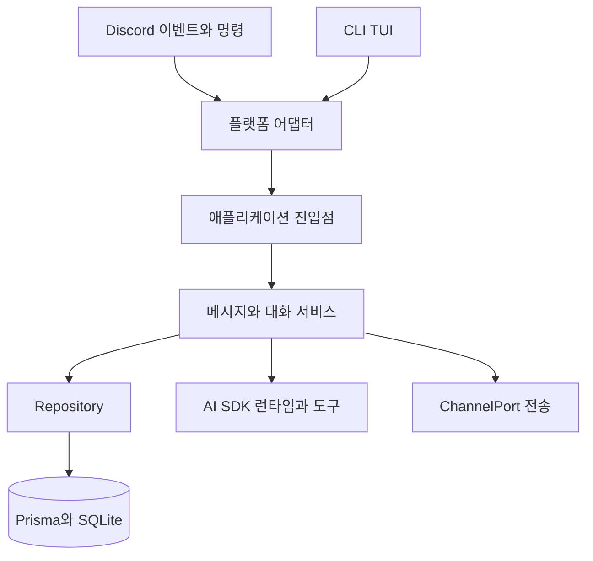

# 전체 아키텍처

Discord와 CLI의 외부 객체는 어댑터에서 공통 계약으로 변환한다. 이후 메시지 저장·대화 생성·전송 흐름을 공유한다. Node.js ESM으로 작성되어 있고, 영속 데이터는 Prisma와 SQLite를 사용한다.

## 디렉터리 책임

| 경로 | 책임과 주요 수정 지점 |
| --- | --- |
| `src/application/` | 계약, 채널 활성화·목록, 삭제·생성 정보·재생성 유스케이스 |
| `src/platforms/` | Discord 이벤트·명령과 CLI TUI, 입력·출력 어댑터 |
| `src/messages/` | 상태·사건 저장 조정, 히스토리 변환, 응답 전송 |
| `src/chat/` | 세션·버퍼, 생성 수명주기, 컨텍스트와 응답 파싱 |
| `src/ai/` | 모델 선택, 채팅·이미지 SDK 호출, dialect와 API 메타데이터 |
| `src/repositories/`, `src/database/` | Prisma 조회·트랜잭션과 클라이언트 |
| `src/tools/` | 도구 정의, 필터링, 실행 의존성, 이미지 작업 |
| `src/core/` | DI 조립, 이벤트, 로깅, 종료 |
| `src/config/`, `src/character/`, `src/accounts/` | 설정 검증, 캐릭터 구성, 봇 계정 준비 |
| `src/utils/` | 템플릿 렌더링과 런타임·Windows 유틸리티 |
| `content/` | 비공개 캐릭터·프롬프트와 생성 이미지 |
| `scripts/`, `test/` | 설치 보조·프롬프트 비교, 단위·통합 검증 |

## 의존성과 조립

`createContainer`가 Repository부터 도구·서비스·유스케이스를 생성하고 의존성을 연결한다. Discord bootstrap은 이벤트와 명령에 필요한 진입점만 주입한다. 플랫폼 핸들러에서 Prisma를 직접 다루는 대신 애플리케이션 진입점을 사용한다.

주 응답 경로는 직접 호출로 구성한다. `EventBus`는 `generation.started/cancelled/completed/failed`를 전달하며 리스너를 순서대로 실행하고 오류를 수집한다. 현재 container에는 기억 추출 리스너가 등록되어 있지 않다.

플랫폼 SDK는 플랫폼 어댑터와 플랫폼 전용 도구에서 사용한다. 대화 흐름 자체는 Discord.js 객체를 받지 않는다. 새 의존성은 container에서 조립하고 서비스 생성자에 전달한다.

## 실행 중 객체를 따라 읽는 방법

container는 한 실행 환경에서 공유할 객체들을 한 번 조립한다. Repository·세션·버퍼·도구 registry는 각 메시지마다 새로 만들지 않는다. ChatFlow.execute 안의 generation·abortSignal·prepared 값은 한 번의 생성 작업에 속한다.

한 사용자의 발언을 추적하려면 플랫폼 adapter, MessageHandler, MessageService, ConversationBuffer, ChatFlow 순서로 읽는다. 내용이 모델에 어떻게 보이는지는 ChatContextPreparer와 HistoryService, SequenceBuilder에서 확인한다. 화면 전송의 문제라면 MessageSender와 플랫폼 ChannelPort 구현을 확인한다.

| 변경하려는 행동 | 먼저 볼 구성 요소 | 함께 확인할 문서 |
| --- | --- | --- |
| 언제 답할지 | MessageHandler·ConversationSession·Buffer | 대화 세션과 버퍼 |
| 과거 대화를 어떻게 볼지 | EventRepository·HistoryService | 메시지와 관찰 사건 |
| 모델 입력 순서 | ChatContextPreparer·SequenceBuilder | 컨텍스트와 프롬프트 |
| 결과 분할과 전송 | AIResponseParser·MessageSender | 생성과 전송 및 재생성 |
| 모델과 API 선택 | ai/config·models·dialects | 모델과 설정 |
| 플랫폼 기능 추가 | application 계약·플랫폼 adapter | 플랫폼 독립 계약 |

## 설계 이유와 현재 한계

정규화 계약은 Discord SDK의 객체 수명과 조회 방식을 공통 대화 정책에서 분리한다. Repository는 영속 데이터 연산을 모으고, Lifecycle은 CHAT 상태 변경의 의미를 이름으로 드러낸다. Session은 DB 트랜잭션만으로 표현하기 어려운 현재 작업 소유권과 시간 범위를 관리한다.

이 분리가 모든 의존성을 완전히 숨긴다는 뜻은 아니다. 플랫폼 전용 도구는 client를 전달받고, container는 실제 서비스들을 직접 구성한다. 새 추상 계층을 추가하기 전에 현재 경계에서 책임을 배치할 수 있는지 확인한다.

EventBus.emitAsync는 리스너를 순차적으로 await하므로 오래 걸리는 리스너는 호출자를 지연시킬 수 있다. 보조 기능을 붙일 때 완료 알림에 느린 외부 작업을 그대로 연결할지, 별도의 실행 단위를 둘지 판단해야 한다.

## 근거와 검증

구현: `src/core/container.js`, `src/core/EventBus.js`, `src/platforms/discord/createDiscordApplication.js`.

테스트: `test/core/container.test.js`, `test/core/EventBus.test.js`, `test/platforms/discord/createDiscordApplication.test.js`, `test/integration/ChatPipeline.integration.test.js`.

[홈](../홈.md) · [시작과 종료](시작과%20종료.md) · [플랫폼 독립 계약](플랫폼%20독립%20계약.md)
