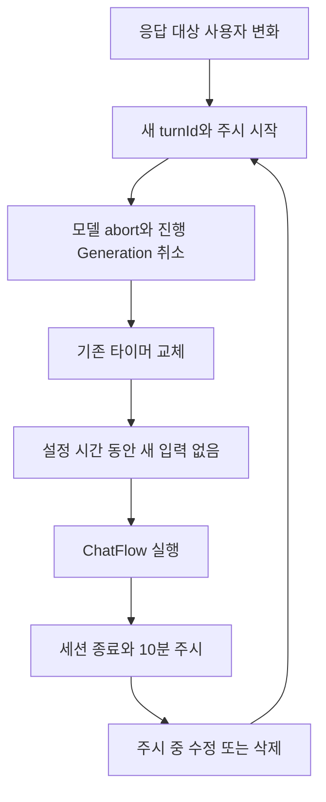

# 대화 세션과 버퍼

ConversationSession은 채널별 짧은 상태 변경의 순서와 현재 작업 소유권을 관리한다. ConversationBuffer는 마지막 입력 이후 일정 시간 기다렸다 생성하는 debounce만 담당한다.

## 순서와 주시

세션 키는 `[platform, platformChannelId]` 튜플을 JSON 문자열로 만든다. 이름이 같은 다른 플랫폼 채널을 섞지 않는다. `run`은 채널별 Promise 큐로 작업을 직렬화하고 실패한 작업 뒤에도 다음 작업을 진행한다.

입력 수신 시각을 큐 진입 전에 기록해 주시 여부를 판단한다. 시간 비교에는 monotonic clock인 `performance.now()`를 사용하고 DB 관찰 시각에는 Date를 사용한다.

주시 범위는 버퍼 대기·생성·전송이 활성 상태인 동안과 종료 뒤 기본 10분이다. 정상 완료는 마지막 전송 완료 시각을 기준으로 settle한다. 실패·취소도 현재 turn의 finally에서 settle할 수 있으므로 정상 전송만 주시를 만드는 것은 아니다. 재시작하면 메모리 주시 상태는 사라진다.

## 버퍼와 취소

`conversation.bufferTimeout`의 현재 기본값은 5000ms이고 생성자에서 읽는다. 같은 채널의 새 요청은 타이머를 교체한다. 메시지 배열 자체를 버퍼에 쌓는 대신 DB 사건에서 입력을 구성한다.

새 turn은 Symbol로 식별한다. 모델 abort뿐 아니라 `isCurrent`와 DB 상태 검사를 사용해 오래된 결과의 저장·후속 전송을 막는다. provider가 취소를 늦게 처리해도 상태를 되돌리지 않는다.

모델 호출, 타이핑 지연, 플랫폼 전송의 네트워크 대기는 채널 큐를 점유하지 않는다. 이미 시작한 플랫폼 전송은 뒤늦은 취소로 회수할 수 없으므로 확인된 출력은 저장하고 나머지 전송을 중단한다.

## 세 클래스의 상태를 구분하기

| 클래스 | 메모리 상태 | 주요 메서드 |
| --- | --- | --- |
| ConversationSession | 채널별 turnId·startedAt·active·until, 작업 큐 | begin, isCurrent, isWatching, settle, run |
| ConversationBuffer | 채널별 timer와 예약 turnId | add, schedule, clear, clearAll |
| ChatGenerationAbortRegistry | 내부 채널 ID별 Generation의 AbortController | register, abortChannel, abortAll, unregister |

세션 키는 플랫폼 채널을, abort registry 키는 내부 DB 채널을 가리킨다. 키를 혼용하면 현재 turn 확인은 통과하면서 다른 생성에 abort를 보내는 문제가 생긴다.

begin은 새 turnId를 발급한다. 이미 주시 중이라면 최초 startedAt을 유지한다. settle은 현재 활성 turnId와 일치할 때만 종료 시각을 기록한다. 오래된 작업의 finally가 새 작업의 주시 기간을 연장하거나 끝낼 수 없다.

## 연속 메시지 예시

버퍼가 5초일 때 사용자가 0초에 ‘오늘’, 3초에 ‘저녁 먹을래?’를 보내면 생성은 두 번째 메시지 이후 5초인 약 8초에 예약된다. 첫 타이머는 제거하고 DB에는 두 READ 사건을 모두 보존한다.

8초에 모델 호출이 시작되고 9초에 ‘아, 내일로 하자’가 들어오면 새 turn을 만든다. 기존 요청에 abort를 전달하고 기존 Generation을 취소한 뒤 새 타이머를 예약한다. 이전 cursor가 전진하지 않았으므로 다음 생성은 아직 처리되지 않은 앞선 입력도 포함할 수 있다.

## 왜 큐와 abort와 상태 검사를 함께 쓰는가

큐는 저장과 소유권 변경의 순서를 보장한다. abort는 느린 외부 요청에 중단 의사를 전달한다. isCurrent는 메모리에서 오래된 작업을 판별하며 DB 조건부 갱신은 취소된 결과가 GENERATED로 돌아가는 것을 막는다. 어느 한 장치만으로 네트워크 응답과 DB 기록의 모든 경합을 해결하지 않는다.

run 안에서 모델 호출이나 전송 완료를 기다리면 새 입력이 큐에 갇혀 취소 자체를 실행하지 못한다. 느린 작업을 추가할 때는 큐 밖에서 기다리고, 결과를 반영하는 짧은 단계만 다시 run으로 보호한다. 현재 컨텍스트 준비와 파일 읽기는 run 내부이므로 모든 I/O가 큐 밖에 있다는 뜻은 아니다.

## 근거와 검증

구현: `src/chat/ConversationSession.js`, `src/chat/ConversationBuffer.js`, `src/chat/ChatGenerationAbortRegistry.js`, `src/chat/ChatFlow.js`.

테스트: `test/chat/ConversationSession.test.js`, `test/chat/ConversationBuffer.test.js`, `test/chat/ChatGenerationAbortRegistry.test.js`, `test/integration/ChatPipeline.integration.test.js`.

[홈](../홈.md) · [메시지와 관찰 사건](메시지와%20관찰%20사건.md) · [생성과 전송 및 재생성](생성과%20전송%20및%20재생성.md)
