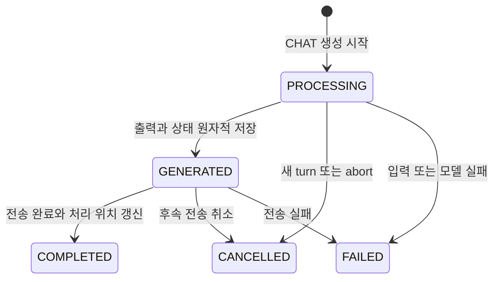
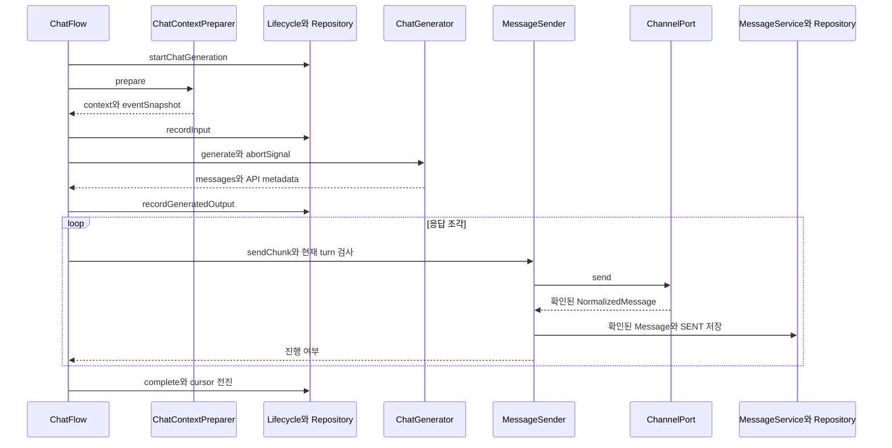

# 생성과 전송 및 재생성

ChatFlow는 한 turn의 입력 준비·모델 호출·결과 저장·조각 전송을 조정한다. DB 상태 전이는 ChatGenerationLifecycle과 GenerationRepository가 담당한다.

## 입력부터 완료까지

1. 현재 turn 확인, 채널 조회, 기존 CHAT 취소, 새 `PROCESSING` 생성과 abort 등록.
2. 사건 snapshot과 컨텍스트 준비, 입력·메시지 연결을 트랜잭션으로 저장.
3. 큐 밖에서 AI 호출. 현재 turn과 `PROCESSING` 상태를 확인해 진행.
4. `PROCESSING → GENERATED`와 출력·API 메타데이터를 조건부로 함께 저장.
5. 파싱된 메시지를 순서대로 전송. 타이핑 지연 뒤 현재 turn과 상태를 재확인.
6. 확인된 플랫폼 출력은 Message·SENT로 저장. 정상 완료와 처리 cursor 전진을 한 트랜잭션으로 처리.

파서는 `## messages` 본문을 `[BREAK]`로 나눈다. 임의 길이로 Discord 제한에 맞춰 자르는 기능은 현재 sendChunk에 없다. 빈 출력·유효하지 않은 이미지 태그만 남은 출력 등 실제 전달이 하나도 없으면 실패한다.

전송 성공 뒤 저장이 실패하면 MessageSender가 저장을 한 번 재시도한다. 실패·취소 시 이미 전송한 출력은 자동 삭제하지 않고 처리 cursor도 완료로 전진시키지 않는다. 장애 응답은 FAILED 상태에서 별도 허용 경로로 전송하며 현재 turn 확인을 유지한다.

## 재생성

Discord ‘재생성’ 명령은 DB에 저장된 봇 Message의 Generation과 입력을 확인한다. 같은 Generation의 활성 봇 출력들을 플랫폼에서 삭제하고 확인된 삭제 ID를 유스케이스에 전달한다.

원래 Generation에 `discardedAt`을 기록하고 삭제를 반영한 후 `rerollGenerationId`를 지정해 ChatFlow를 실행한다. HistoryService는 저장된 원래 eventSnapshot과 현재 사건을 중복 제거·병합한다. 따라서 과거 API 요청을 그대로 재전송하는 것은 아니며 새 입력과 현재 프롬프트가 반영될 수 있다.

‘최신 Generation만 재생성’이나 ‘장기 기억 추출 전만 재생성’ 정책은 현재 prepare에 없다. 스냅샷이 없으면 재생성 중 오류가 발생한다. 플랫폼 삭제 일부가 실패하면 실패한 출력이 화면에 남을 수 있다.

## 클래스별 책임과 반환 계약

| 클래스 | 주요 메서드 | 책임 |
| --- | --- | --- |
| ChatFlow | execute | 전체 순서와 현재 작업 확인. 별도 응답 데이터 대신 저장·전송 부수 효과를 수행 |
| ChatContextPreparer | prepare | 모델 입력과 기록할 snapshot 구성 |
| ChatGenerator | generate | messages·apiRequests·apiResponses 반환 |
| ChatGenerationLifecycle | recordInput, recordGeneratedOutput, complete | CHAT의 상태 변경 의도를 Repository 호출로 표현 |
| MessageSender | sendChunk | 전달 가능한 조각 전송·저장. 취소면 false, 진행 가능하면 true |
| ChatGenerationFailureHandler | handle | 실패 상태·이벤트·사용자 안내 처리 |
| RerollConversation | prepare, execute | 재생성 대상 조회와 철회·재실행 |

sendChunk의 true는 항상 네트워크 전송을 뜻하지 않는다. 빈 문자열이나 첨부 해석 후 빈 조각도 true로 건너뛸 수 있다. ChatFlow는 onDelivered에서 기록한 sentAt이 존재하는지를 별도로 확인해 실제 출력 없는 완료를 막는다.

## 전송 단계의 경합

MessageSender는 먼저 이미지 태그를 해석하고 타이핑 표시·문자 수 기반 지연을 수행한다. 지연은 min과 max 사이로 제한한다. 실제 send 직전에 큐 안에서 현재 turn과 GENERATED 상태를 다시 확인하고, 전송 Promise를 시작한 뒤 큐를 해제한다.

전송 요청이 시작된 후 새 메시지가 도착하면 플랫폼 API를 이미 호출했으므로 해당 조각이 화면에 표시될 수 있다. 반환된 메시지는 취소 여부와 별개로 확인된 출력으로 저장한다. 다음 조각은 현재 turn 검사에서 중단한다.

네트워크가 성공하고 DB 저장만 실패한 경우 저장만 한 번 재시도한다. send를 다시 호출하면 같은 답변이 중복 전송되기 때문에 재시도 범위를 저장 단계로 제한한다.

## 정상 응답의 호출 순서

그림의 Message·SENT 저장 경로는 MessageRepository·EventRepository를 사용하며 Generation 수명주기 저장과 구분한다. 도식은 호출 순서를 보여주기 위해 각 저장 경로의 Repository를 해당 참가자로 묶었다. 큐 점유 범위는 [대화 세션과 버퍼](대화%20세션과%20버퍼.md)의 설명을 함께 확인한다.

## 실패와 복구 예시

모델 호출이 실패하면 Generation은 FAILED가 되고 안내 메시지를 보낼 수 있다. 안내가 SENT로 남아 컨텍스트 배치의 마지막 봇 발언 경계는 바뀔 수 있지만 처리 cursor는 전진하지 않는다. 다음 사용자 발언이 들어오면 실패한 입력과 새 입력을 함께 처리할 수 있다.

이벤트 리스너 오류는 EventBus가 수집한다. 반면 DB 완료 처리나 플랫폼 send의 오류는 주 흐름의 실패 경로로 전달된다. 장애 분석에서는 ‘모델 출력 존재’, ‘플랫폼 전송 확인’, ‘cursor 완료’ 세 단계를 따로 확인한다.

## 재생성에서 남는 것과 바뀌는 것

원래 Generation.input의 경험 snapshot은 재사용할 근거이고, discardedAt은 원래 출력의 컨텍스트 가시성을 바꾼다. 기존 cursor를 과거로 되돌리지 않는다. snapshot 이후에 철회된 다른 출력도 재생성에 다시 나타나지 않도록 조회 시 필터링한다.

prepare의 READY는 대상 정보가 준비됐다는 뜻이다. 플랫폼 삭제나 새 생성 성공까지 보장하지 않는다. Discord 명령과 유스케이스 사이에는 삭제 성공 ID를 전달하는 경계가 있으므로 부분 삭제 실패를 무시하고 전체 성공으로 기록하면 안 된다.

## 근거와 검증

구현: `src/chat/ChatFlow.js`, `src/chat/ChatGenerationLifecycle.js`, `src/messages/MessageSender.js`, `src/application/RerollConversation.js`, `src/repositories/GenerationRepository.js`.

테스트: `test/chat/ChatFlow.test.js`, `test/chat/ChatGenerationLifecycle.test.js`, `test/application/useCases.test.js`, `test/integration/ChatPipeline.integration.test.js`.

[홈](../홈.md) · [대화 세션과 버퍼](대화%20세션과%20버퍼.md) · [컨텍스트와 프롬프트](../AI/컨텍스트와%20프롬프트.md)
