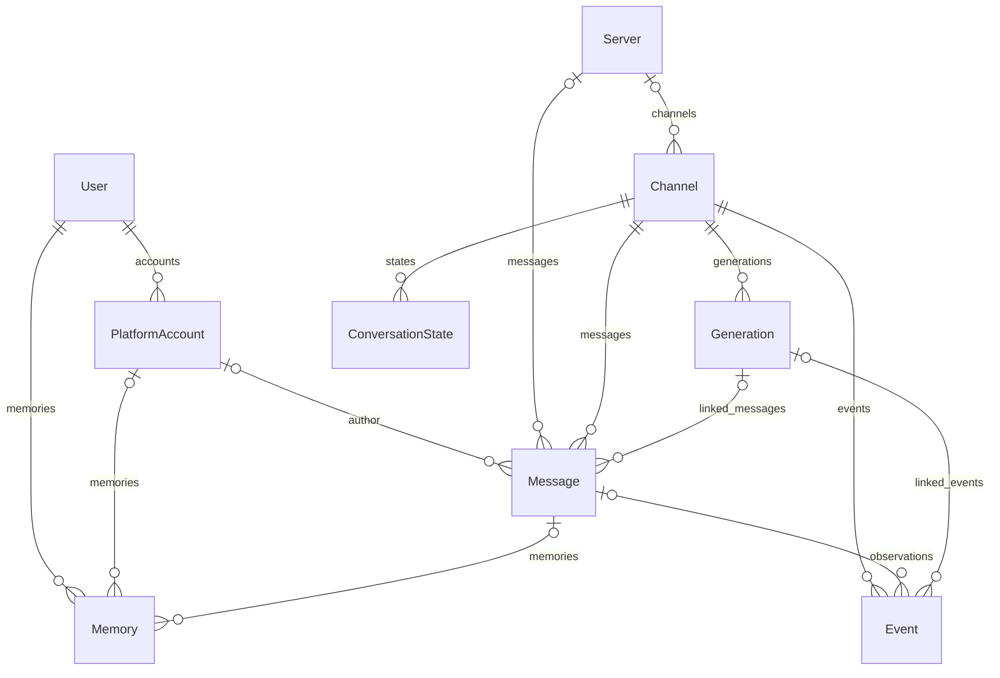

# 데이터 모델

Prisma 스키마는 SQLite를 사용한다. `npm run db:init`은 Client 생성과 db push를 실행하며 별도 migration 이력을 관리하지 않는다.

## 모델의 역할

| 모델 | 역할 |
| --- | --- |
| User | 내부 사용자. 여러 플랫폼 계정을 연결할 수 있는 스키마 구조 |
| PlatformAccount | 플랫폼 사용자 ID와 handle·displayName |
| Server | 플랫폼 서버 식별자 |
| Channel | 플랫폼 채널, 선택적 서버·scope |
| Message | 최신 본문·첨부, 작성자, 수정·삭제 시각, 생성 연결 |
| Event | 캐릭터별 READ·EDIT·DELETE·SENT 경험과 불변 본문 snapshot |
| ConversationState | 캐릭터·채널별 `handledThroughEventId` cursor |
| Generation | CHAT·IMAGE 생성의 상태, 고정 입력·출력, API 기록, sentAt·discardedAt |
| Memory | 사용자 기억용 스키마. 현재 추출·검색 런타임은 연결되어 있지 않음 |

PlatformAccount가 여러 개인 User 구조는 있지만 계정을 자동으로 동일인으로 병합하지 않는다. 새 플랫폼 계정은 MessageService에서 새 User를 만든다.

Event와 Generation의 `characterId`는 문자열이며 Character 모델과 외래 키 관계가 없다. 캐릭터 정의는 파일에 있다. Event.messageId는 nullable이고 Message 삭제 시 SetNull 정책을 가진다. 일반 삭제는 행 삭제 대신 soft delete를 사용한다.

Generation의 type·status, Event의 kind·source, Channel의 scope는 Prisma enum이 아니라 String이다. 스키마 주석에 있는 VOICE·EMBEDDING이나 PENDING을 모두 실제 생성 경로로 해석하지 않는다. 현재 주 사용 경로는 CHAT과 IMAGE다.

## 필드 묶음으로 읽기

Message의 content·attachmentsJson·editedAt·deletedAt는 현재 플랫폼 상태를, authorId·channelId·serverId는 소속을, generationId는 처리 또는 출력 연결을 나타낸다. 사용자 입력 Message도 Generation에 연결될 수 있으므로 generationId만 보고 봇 출력으로 분류하지 않는다. isBot과 작성자를 함께 본다.

Event의 snapshotContent·snapshotAttachmentsJson은 당시 관찰 본문이다. previousContent는 EDIT 설명에, batchId는 일괄 삭제 묶음에 사용한다. source=HISTORY와 kind=READ의 조합은 현재 과거 내역을 읽는 경험이고, 과거 시점에 편집을 목격했다는 뜻이 아니다.

Generation의 apiRequest·apiResponse·metadata는 JSON 문자열이고 output은 type에 따라 CHAT 메시지 배열 또는 IMAGE 파일명이다. IMAGE input은 렌더링한 프롬프트 문자열, CHAT input은 입력 사건 snapshot을 포함하는 JSON이다. 다른 type을 추가하면 이 의미 차이를 명시해야 한다.

## 영속 상태와 메모리 상태

| 정보 | 저장 위치 | 재시작 뒤 유지 |
| --- | --- | --- |
| 최신 메시지와 관찰 사건 | Message·Event | 유지 |
| 처리 완료 위치 | ConversationState | 유지 |
| 생성 상태·입력·출력 | Generation | 유지 |
| 캐릭터 정의와 프롬프트 | content 파일 | 파일이 존재하면 유지 |
| 현재 turn과 주시 종료 시각 | ConversationSession | 초기화 |
| 예약 타이머와 abort controller | Buffer·AbortRegistry | 초기화 |

주시 여부를 DB cursor로 복원하지 않는다. cursor는 처리 진행도이고 주시는 최근 작업의 시간 범위이기 때문이다. 반대로 세션이 초기화됐다는 이유로 과거 경험이나 cursor를 삭제하지 않는다.

## 근거와 검증

구현: `prisma/schema.prisma`, `src/database/client.js`, `src/messages/MessageService.js`, `src/repositories/GenerationRepository.js`.

테스트: `test/messages/MessageService.test.js`, `test/chat/ChatGenerationLifecycle.test.js`, `test/integration/ChatPipeline.integration.test.js`.

[홈](../홈.md) · [저장과 식별자](저장과%20식별자.md) · [메시지와 관찰 사건](../대화/메시지와%20관찰%20사건.md)
